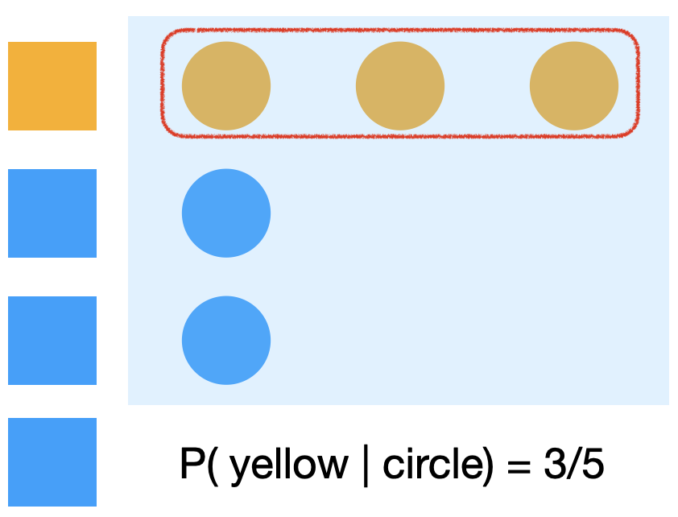

```{r xaringan-themer, include=FALSE, warning=FALSE}
library(tidyverse)
library(xaringanthemer)

primary_color = "#2C492A"  # Clay court orange
secondary_color = "#D27F63"  # Deep green for contrast
background_color = "#FAF3EB"  # Light clay beige
header_font = google_font("Archivo")
text_font = google_font("Inconsolata")
link_color = "#8DC891"  # Subtle green to align with theme

style_duo_accent(primary_color = primary_color, secondary_color = secondary_color,
                 background_color = background_color,
                 header_font_google = header_font,
                 text_font_google   = text_font, 
                 link_color = link_color
)
``` 

class: inverse, center, middle

# Introduction

---
## What is Bayesian Data Analysis?

.pull-left[

]

--

.pull-right[

<br>

- A probabilistic framework for **updating beliefs** based on evidence.

- In Bayesian analysis, **parameters are treated as probability distributions** rather than fixed values.

  - Uncertainty reflects subjective belief and heterogeneity in the system being modeled.

  - Contrasts with frequentist methods, which assume parameters are fixed but unknown, while parameter estimates are random due to sampling.

]

---
## Key Features of Bayesian Analysis

.pull-left[

]

--

.pull-right[

<br>

- **Uncertainty Modeling:** Provides a full probability distribution for parameters, not just point estimates.

- **Flexibility:** Supports models with no closed-form solutions (e.g., hierarchical and latent variable models).

- **Intuitive Inference:** Allows for easy interpretation of credible intervals (e.g., "There is a 95% probability that this parameter lies within this range").

- **Prior Information:** Allows incorporation of prior knowledge or expert opinion into the analysis.

]

---
class: inverse, center, middle

# Background 

---
## Thomas Bayes
.middle[.center[]]

---
## Conditional probability

The probability of $A$ given $B$ is defined as:

$$\mathbb{P}(A \mid B) = \frac{\mathbb{P}(A,B)}{\mathbb{P}(B)} \quad \quad \quad \quad \quad $$

<br>
--

.center[

]


---
## Conditional probability

The probability of $B$ given $A$ is defined as:

$$\mathbb{P}(B \mid A) = \frac{\mathbb{P}(A,B)}{\mathbb{P}(A)} \quad \quad \quad \quad \quad$$

<br>
--

.center[

]


---
## Conditional probability

Therefore, if the probability of $A$ given $B$ is defined as:

$$\mathbb{P}(A \mid B) = \frac{\mathbb{P}(A,B)}{\mathbb{P}(B)} \quad \quad \quad \quad \quad (1)$$

<br>
--

and the probability of $B$ given $A$ is defined as:

$$\mathbb{P}(B \mid A) = \frac{\mathbb{P}(A,B)}{\mathbb{P}(A)} \quad \quad \quad \quad \quad (2)$$
<br>
--

Then, rearranging (2) we obtain:

$$\mathbb{P}(A,B) = \mathbb{P}(B \mid A)\mathbb{P}(A) \quad \quad \quad \quad  (3)$$
<br>
--

And replacing (3) in (1) gives:

$$\mathbb{P}(A \mid B) = \frac{\mathbb{P}(B \mid A)\mathbb{P}(A)}{\mathbb{P}(B)} \quad \quad \quad \quad \quad$$

---
## Bayes' Theorem

Thus, if

$$\mathbb{P}(A \mid B) = \frac{\mathbb{P}(B \mid A)\mathbb{P}(A)}{\mathbb{P}(B)} \quad \quad \quad \quad \quad $$

<br>
Rearranging the expression, we find...

<br>
--

**Bayes' Theorem:**

.full-width[.content-box-primary[
$$\color{white}{\mathbb{P}(B \mid A) = \frac{\mathbb{P}(A \mid B)\mathbb{P}(B)}{\mathbb{P}(A)} \quad \quad \quad \quad \quad}$$
]
]

---
## The usual disease testing example

<br>


.pull-left[

- 1% of the population has a certain disease.

- The test is 99% accurate for both true positives and true negatives.

]


.pull-right[


]

<br>
--

**Question:** If a person tests positive, what is the probability they have the disease?

---
## Applying Bayes' Theorem

We seek: $P( D=\text{yes} |T=\text{+})$

<br>
--

According to the Bayes' Theorem:


$$
P( D=\text{yes} |T=\text{+}) = \frac{P(T=\text{+}| D=\text{yes}) \times P(D=\text{yes})}{P(T=\text{+})}
$$

<br>
--

By the law of total probability we can expand the denominator ...


$$
P(D=\text{yes}|T=\text{+}) = \frac{P(T=\text{+}|D=\text{yes}) \cdot P(D=\text{yes})}{P(T=\text{+}|D=\text{yes}) \cdot P(D=\text{yes}) + P(T=\text{+}|D=\text{no}) \cdot P(D=\text{no})}
$$
<br>
--
Using the information we have we obtain...

- Disease prevalence: $P(D=\text{yes}) = 0.01$.
- True positive rate: $P(T=\text{+}| D=\text{yes}) = 0.99$.
- True negative rate: $P(T=\text{-}| D=\text{no}) = 0.99$.


---
## Applying Bayes' Theorem

<br>
Denominator: 

$$
\begin{split}
P(T=\text{+}) &= \\
&= P(T=\text{+}|D=\text{yes}) \cdot P(D=\text{yes}) + P(T=\text{+}|D=\text{no}) \cdot P(D=\text{no}) \\
&= 0.99 \times 0.01 + 0.01 \times 0.99 = 0.0198
\end{split}
$$

<br>
--

Thus,

$$
P(D=\text{yes}|T=\text{+}) = \frac{0.99 \times 0.01}{0.0198} \approx 0.50
$$

<br>

- Despite the test's accuracy, only **50%** of positive results indicate the disease.

- The low prior probability (prevalence) strongly impacts the posterior probability.


---
class: inverse, center, middle

# Frequentist & Bayesian estimation


---
##  A "true" model

<br>

- To illustrate Frequentist & Bayesian Regression Modeling we will play god and generate data according to a "true" data generatin process (DGP)

--

.pull-left[


]

.pull-right[

DGP: 

- $y_i \sim \text{Normal}(\overbrace{\beta_0 + \beta_1 x_i}^{\mu_i}, \overbrace{\delta_0 + \delta x_i}^{\sigma_i})$

- $\beta_0 = 0.5, \quad \beta_1 = 1.1$

- $\delta_0 = 1 \quad \delta_1 = 0.4$

]

---
##  A "true" model

.pull-left[


```{r,  include=TRUE, echo=FALSE, warning=FALSE, message=FALSE}
library("tidyverse")
library("Ecdat")
library("cowplot")
library("ggridges")
library("modelr")

# Font setup
library(hrbrthemes)
library(showtext)
font_add_google("Archivo", "header_font")
font_add_google("Inconsolata", "text_font")

```


```{r}
x    <- rnorm(n=10^5,mean=0,sd=1) 
g    <- sample(c(0,1), size=10^5, replace=T)
beta0  <- 0.5; beta1 <- 1.1
delta0 <- 1; delta1 <- 0.4
mu     <- beta0 + beta1*x 
sigma  <- delta0 + delta1*g 
y    <- rnorm(n=10^5,mean=mu,sd=sigma)

```

```{r, echo=FALSE}
sim_data <- tibble(x=x,g=g,y=y)
print(sim_data)
```
]

--

.pull-right[
```{r,  include=TRUE, echo=FALSE, warning=FALSE, message=FALSE}
plot <- sim_data %>%
  ggplot(aes(x=x, y=y, colour = factor(g))) +
  geom_point(size=2.5, alpha=0.2) + 
  geom_smooth(method='lm', formula= y ~ x, size=1.5, color=link_color, se=FALSE) + # Added se=FALSE to remove shaded region
  theme_minimal() +
  theme(
    legend.position="none",
    axis.text.y = element_text(size = 22, color = "black"),
    axis.text.x = element_text(size = 22, color = "black"),
    axis.title.y = element_text(size = 24, color = "black"),
    axis.title.x = element_text(size = 24, color = "black"),
    panel.border = element_rect(color = "black", fill = NA, linewidth = 1)
  )

print(plot)
```
] 

---
class: inverse, center, middle

# Frequentist Estimation

---
# Frequentist Estimation

.bold[Maximum likelihood estimation:]

What combination of values $\boldsymbol{\theta}: \{\beta_0, \beta_1, \sigma\}$ is the most plausible ("likely") given the observed data?

MLE formalizes this question. Steps:

--

1) Decide on the underlying distribution generating the data. In this case, we can assume:

   * Each observation $x_{i} \sim \text{Normal}(\mu_i = \beta_0 + \beta_1 x_i, \sigma)$, where X's are $iid$.

--

2) Write a function to quantify the plausibility of different parameter values. This function is called the .bold[likelihood function]:

   * $\text{Likelihood}(\boldsymbol{\theta} \mid \text{Data}) = \mathbb{P}(\text{Data} : \{0.34, 1.07, 1.83, \dots, x_{n} \} \mid \boldsymbol{\theta})$

<br>
--

Thus, the MLE estimator is this particular case is given by:

.content-box-primary[
$$\color{white}{
\hat{\boldsymbol{\theta}}_{MLE} = \underset{\boldsymbol{\theta}}{\arg\max} \prod_{i=1}^{n} \frac{1}{\sqrt{2\pi\sigma^{2}}} e^{- \frac{(y_{i} - \mathbf{\mu}_{i})^{2}}{2\sigma^{2}}}}$$
]


---
# Frequentist Estimation


.bold[Maximum likelihood estimation:]

.pull-left[
```{r,  include=TRUE, echo=FALSE, warning=FALSE, message=FALSE, fig.height=6}

ll <- function(a, b) {
  y = sim_data$y
  eta = a + b * x
  ell = sum(dnorm(y, mean = eta, sd = 1, log = TRUE))  # Log-likelihood
  return(ell)
}

# Define a parameter space
parameter_space <- expand.grid(beta0 = seq(-3, 3, length.out = 50), 
                                beta1 = seq(-3, 3, length.out = 50)) %>% 
  rowwise() %>% 
  mutate(loglik = ll(beta0, beta1))

m <- parameter_space %>% as.matrix()

# Visualization
parameter_space %>% 
  ggplot(aes(x = beta0, y = beta1, z = loglik)) +
  geom_contour(bins = 50) +
  geom_contour_filled(bins = 50, alpha = 0.75) +
  geom_point(aes(x = m[which.max(m[, 3]), 1], y = m[which.max(m[, 3]), 2]), size = 2) +
  labs(x = expression(beta[0]), y = expression(beta[1])) +
  theme_minimal() +
  theme(
    axis.text = element_text(size = 14),
    axis.title = element_text(size = 16), legend.position = "none"
  )
```
]

.pull-right[

- Surface shows how different parameter combinations $(\beta_0, \beta_1)$ result in different likelihoods.

- The *MLE* corresponds to the highest point on the surface.

- Maximization can be closed-form or algorithmic (e.g., Newton-Raphson).

]


---
## Frequentist Estimation

```{r}
our_lm_mle <- glm(y ~ x, family="gaussian", data=sim_data) 
print(summary(our_lm_mle)) 
```

---
## Frequentist Estimation

.pull-left[
```{r, echo=FALSE, message=FALSE,warning=FALSE}

library(ggplot2)
library(viridis)
library(dplyr)
library(tibble)

# Extract coefficients and sigma from the model
intercept <- coef(summary(our_lm_mle))["(Intercept)", "Estimate"]
beta <- coef(summary(our_lm_mle))["x", "Estimate"]
sigma <- sqrt(summary(our_lm_mle)$dispersion)  # Given residual variance

# Define the new point for prediction
new_x <- c(1)
new_y <- predict(our_lm_mle, newdata = tibble(x = new_x))

# Create vertical and horizontal line positions
positions_v <- data.frame(x = new_x, y = c(0), xend = new_x, yend = new_y)
positions_h <- data.frame(x = c(0), y = new_y, xend = new_x, yend = new_y)

# Generate the plot
plot <- tibble(x = x, y = y) %>%
  ggplot(aes(x = x, y = y)) +
  geom_point(color = primary_color, size = 2.5, alpha = 0.05) +
  geom_smooth(method = 'lm', formula = y ~ x, size = 1.5, color = link_color, se = FALSE) + 
  annotate(geom = "text", x = min(x), y = max(y), 
           label = sprintf("Intercept (α): %.3f", intercept), 
           hjust = 0, vjust = 1, color = secondary_color, size = 6) +
  annotate(geom = "text", x = min(x), y = max(y) - 0.5, 
           label = sprintf("Coefficient for x (β): %.3f", beta), 
           hjust = 0, vjust = 1, color = secondary_color, size = 6) +
  annotate(geom = "text", x = min(x), y = max(y) - 1, 
           label = sprintf("Residual Std. Dev. (σ): %.3f", sigma), 
           hjust = 0, vjust = 1, color = secondary_color, size = 6) +
  theme_minimal() +
  theme(
    legend.position = "none",
    axis.text.y = element_text(size = 22, color = "black"),
    axis.text.x = element_text(size = 22, color = "black"),
    axis.title.y = element_text(size = 24, color = "black"),
    axis.title.x = element_text(size = 24, color = "black"),
    panel.border = element_rect(color = "black", fill = NA, linewidth = 1)
  )

plot


```
]

--

.pull-right[

<br>

- The true parameters $\boldsymbol{\theta}: \{\beta_0, \beta_1, \sigma\}$ are unknown and fixed.

- The parameters' estimates  $\boldsymbol{\hat{\theta}}: \{\hat{\beta_0}, \hat{\beta_1}, \hat{\sigma}\}$ are random because the are estimated on a random sample ("sampling distribution"). 

]


---
class: inverse, center, middle

# Bayesian Estimation

---
# Bayesian Estimation


.pull-left[

]

--

.pull-right[

- While frequentist estimation is based on the probability of the data for a given fixed value of the parameter, Bayesian estimation directly addresses the .bold[probability of different parameter values given the observed data].

- Hence, in Bayesian estimation parameters are treated as probability distribution.

- Randomness of parameters reflect subjective belief and heterogeneity in the system being modeled.


]


---
# Bayesian Estimation


<br>

- Bayes’ theorem provides a probabilistic framework to estimate parameters ( $\theta$ )  based on observed data.

- We want to know what is the probability associated to different possible values of a parameter: $P(\theta \mid \text{Data})$

--

- We can use the Bayes' Theorem to get what we want:

<br>

$$
P(\theta \mid \text{Data}) = \frac{P(\text{Data} \mid \theta) P(\theta)}{P(\text{Data})}
$$
---
# Bayesian estimation

<br>

- Bayes’ theorem provides a probabilistic framework to estimate parameters ( $\theta$ )  based on observed data.

- We want to know what is the probability associated to different possible values of a parameter: $P(\theta \mid \text{Data})$

- We can use the Bayes' Theorem to get what we want:


<br>

$$
\begin{split}
P(\theta \mid \text{Data}) &= \frac{P(\text{Data} \mid \theta) P(\theta)}{P(\text{Data})} \\ \\
&= \frac{P(\text{Data} \mid \theta) P(\theta)}{\int_{\theta} P(\text{Data} \mid \theta) P(\theta) d\theta} \\
\end{split}
$$
--
 
Where:

- The integral is taken over the entire parameter space $\boldsymbol\theta: (\beta_0, \beta_1, \sigma)$.  

- This integral ensures that $P(\theta \mid \text{Data})$ sums to 1, forming a proper probability distribution.  


---
# Bayesian Estimation

<br>

$$
P(\theta \mid \text{Data}) = \frac{P(\text{Data} \mid \theta) P(\theta)}{P(\text{Data})} 
$$


---
# Bayesian Estimation

<br>

$$
\overbrace{P(\theta \mid \text{Data})}^{\color{red}{\text{POSTERIOR}}} = 
\frac{\overbrace{P(\text{Data} \mid \theta)}^{\color{blue}{\text{LIKELIHOOD  }}} \overbrace{P(\theta)}^{\color{green}{\text{  PRIOR}}}}
{\underbrace{P(\text{Data})}_{\color{purple}{\text{EVIDENCE}}}}
$$

<br>
--


- **Parameters of interest**: $\theta = (\beta_0, \beta_1, \sigma)$

- **Likelihood**: how compatible the data is with $\theta$.

- **Prior**: Encodes beliefs about $\theta$ (i.e., $\beta_0$, $\beta_1$, and $\sigma$) before observing the data.

- **Evidence**:  Normalizing constant, computed as the integral over all possible parameter values.

- **Posterior**:  Updated beliefs about $\theta$ after observing data, combining prior information and likelihood.
  


---
# Bayesian Estimation


.pull-left[

$$\overbrace{P(\theta \mid \text{Data})}^{\color{red}{\text{POSTERIOR}}} = 
\frac{\overbrace{P(\text{Data} \mid \theta)}^{\color{blue}{\text{LIKELIHOOD  }}} \overbrace{P(\theta)}^{\color{green}{\text{  PRIOR}}}}
{\underbrace{P(\text{Data})}_{\color{purple}{\text{EVIDENCE}}}}$$
  
]

--

.img-right2[


  
]

- Evidence is usually unfeasible to estimate: no closed-form solution and/or high-dimensional spaces.

- Except in the case of **conjugate priors**
  
---
class: inverse, center, middle

# Computing posterior distribution


---
# Sampling from the Posterior

<br>

- Computing the posterior $P(\theta | \text{data})$ exactly is often infeasible because $P(\text{data})$ is hard to calculate.

--

- Instead, we sample values of $\theta$ using:

$$
P(\theta | \text{data}) \propto P(\text{data} | \theta) P(\theta)
$$

- Methods like **MCMC** approximate the posterior by sampling from the unnormalized posterior.

- These algorithms ensure that sampled values are proportional to $P(\text{data} \mid \theta) P(\theta)$ without needing to compute $P(\text{data})$.


---
# Markov Chain Monte Carlo (MCMC)

<br>

**Overview of the MCMC process:**

<br>

- Define the **likelihood** $P(\text{data} | \theta)$ and **prior** $P(\theta)$.

-  MCMC generate a chain of values for $\theta$ that are "weighted" by 
$P(\text{data} \mid \theta) P(\theta)$

- Values of $\theta$ that make the data more probable (high likelihood) and align with the prior (high prior probability) are more likely to be sampled.

---
# Markov Chain Monte Carlo & Metropolist-Hasting

.pull-left[
**MCMC**

]

--

.pull-right[
**MCMC + Metropolis-Hasting**

]

---
# Hamiltonian Monte Carlo (HMC)

- There are different methods to sample from the posterior.

- In particular, **Stan** (the software we will use) relies on HMC for sampling from posterior distributions.

--
<br>

.pull-left[

- HMC uses principles from physics to sample efficiently.

- Simulate the movement of a particle in a energy landscape

- Efficient exploration of posterior landscapes

- Handles correlated parameters well

]

.pull-right[
**Hamiltonian Monte Carlo search**

]


---
class: inverse, center, middle

# Prior choice

---
# Prior choice

.pull-left[
- A **prior distribution** represents beliefs about a parameter before observing the data.

- Choice of prior affects:
  - How much influence prior beliefs have on the posterior.
  
  - The robustness of results with limited data.

]

.pull-right[
.img-right[

]
]

<br><br>
--


| **Case**                | **Example Prior**                         | **Scenario**                                       |
|--------------------------|-------------------------------------------|---------------------------------------------------|
| **Uninformative**        | $P(\theta) \propto 1$                | No prior knowledge; let data dominate.            |
| **Weakly Informative**   | $P(\theta) \sim \mathcal{N}(0, 100^2)$ | Weak constraints on plausible values.             |
| **Strongly Informative** | $P(\theta) \sim \text{Beta}(90, 10)$  | Domain expertise suggests strong prior belief.    |
| **Point-Value**          | $P(\theta) = \delta(\theta - 5)$     | $\theta$ is known with certainty.             |

---
# Prior choice

.center[
  .middle[
    
  ]
]


---
class: inverse, center, middle

# Implementation with **rstan**

---
# Rstan

```{r, eval=TRUE, message=FALSE, warning=FALSE}

# Data list for Stan
data_list <- list(
  N = 10^5,
  x = sim_data$x,
  g = sim_data$g,
  y = sim_data$y
)

# Fit the updated Stan model
library(rstan)
fit <- stan(
  file = "mymodel.stan", 
  data = data_list, 
  iter = 1000, 
  chains = 3, 
  seed = 123
)

```
---
# Stan code

.center[
.middle[

]
]
---
# Posterior distribution

```{r}
# Print results
print(fit, pars = c("beta0", "beta1", "delta0", "delta1"))
```

---
# Posterior distribution

```{r4}
# Posterior distribution plot
posterior_samples <- extract(fit)
beta1_samples <- posterior_samples$beta1
```

.pull-left[
```{r posterior-beta1, echo=FALSE, warning=FALSE, fig.height=4}

ggplot(data = data.frame(beta1 = beta1_samples), aes(x = beta1)) +
  geom_density(fill = "skyblue", alpha = 0.6) +
  geom_vline(xintercept = quantile(beta1_samples, probs = c(0.025, 0.975)), linetype = "dashed", color = "red") +
  labs(
    title = "Posterior Distribution of β1",
    x = expression(beta[1]),
    y = "Density"
  ) +
  theme_minimal()
```
]

.pull-right[

- The **posterior distribution** shows updated beliefs about $\beta_1$ after observing the data. 
- The **credible interval** (dashed lines) gives the range where $\beta_1$ lies with 95% probability.  

- Unlike **confidence intervals**, credible intervals are directly interpretable as probabilities.


]

---
### Confidence Intervals vs Credible Intervals

.center[
.middle[

]
]

---
### Confidence Intervals vs Credible Intervals

<br>
For a given interval -- say, $[1.05, 1.15]$ --, interpretation differs for Frequentist and Bayesian estimation:

<br>
--

**95% Confidence Interval Interpretation**

> *"If we repeated the data collection and analysis many times, 95% of the calculated intervals would contain the true value of $\beta_1$.* 

We cannot assign a probability to the true value being in this range because  $\beta_1$ is a fixed number, not a random variable.

<br>
--

**95% Credible Interval Interpretation**

> *"Given the observed data and our prior beliefs, there is a 95% probability that the true value of $\beta_1$ lies within the interval $[1.05, 1.15]$."*

---
### Diagnostics 

There any many. Here is a very important one: **Trace plots**

```{r, warning=FALSE, fig.height=4, fig.width=8}
library(bayesplot)

# Trace plots for all parameters
mcmc_trace(fit, pars = c("beta1")) +
  ggtitle("Trace Plots for β1") +
  theme_minimal()

```
---
class: inverse, center, middle


# Materials

---

## Github Repo

All the material from the workshop will be stored and regularly updated in the `Github` repository.

<br>
.center[


.bold[https://github.com/mebucca/bayes_workshop]

]


---
class: inverse, center, middle


## :: T H E :: E N D ::

<br>
Mauricio Bucca <br>
https://mebucca.github.io/ <br>
github.com/mebucca


